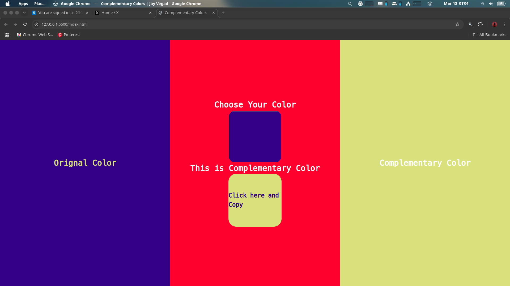

# Complemetry Color Using Html and Javascript

## Features

- Real-time color chnage.
- Showing Color to side by side.
- Add all formate colors as per your choice.

## How It Works

- Store that color hexa code. Parse that code. XOR with 0XFFFFFF. And than complemenry color is find. Assign value to all the divisions.

