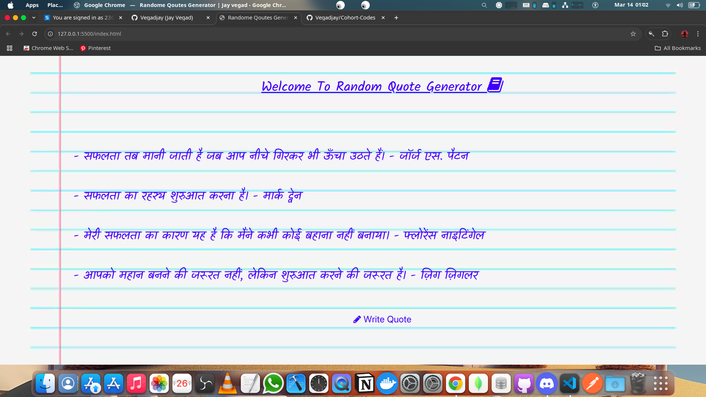

# Complemetry Color Using Html and Javascript

## Features

- Random qoute generator.
- Simple Ui using TAILWIND and CSS.
- Simple JS generate random number and suffle qoute using array.

## How It Works

- Store that color hexa code. Parse that code. XOR with 0XFFFFFF. And than complemenry color is find. Assign value to all the divisions.

