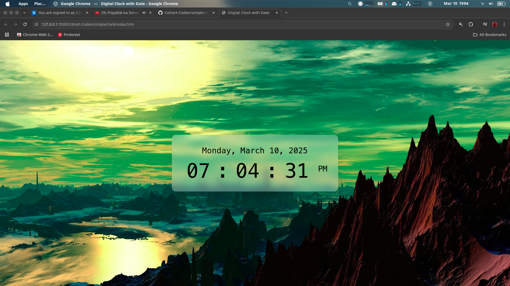

# Digital Clock with Date

A simple, elegant digital clock web application that displays the current time and date on a beautiful landscape background.

## Features

- Real-time digital clock display
- Current date display (Day, Month, Date, Year)
- 12-hour time format with AM/PM indicator
- Responsive design that works on various screen sizes
- Aesthetic backdrop with fantasy landscape

## Screenshot



## How It Works

The application uses HTML, CSS, and JavaScript to create a digital clock that updates in real-time. The time is displayed in a large, easy-to-read format in the center of the screen.

## Installation

1. Clone this repository (Make sure navigate to that folder):
   ```
   git clone https://github.com/Vegadjay/Cohort-Codes.git
   ```
2. Navigate to the project directory:
   ```
   cd digital-clock
   ```
3. Open `index.html` in your web browser

## Usage

Simply open the application in any modern web browser. The clock will automatically display the current time and date based on your system's clock.

## Customization

You can customize the application by:
- Changing the background image in the CSS file
- Modifying the font styles and colors
- Adjusting the clock position and transparency

## Dependencies

- No external libraries required
- Works with any modern web browser

## Author

Jay vegad